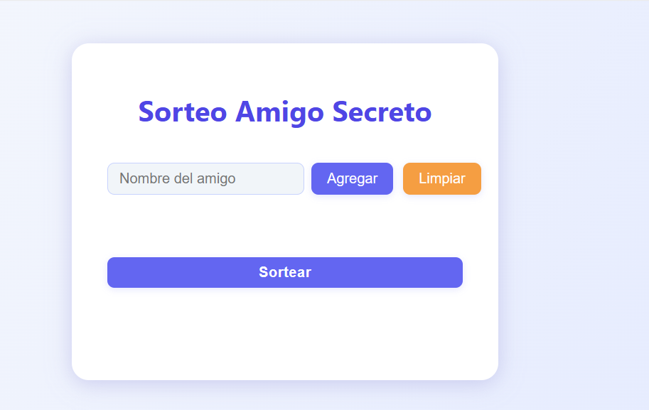
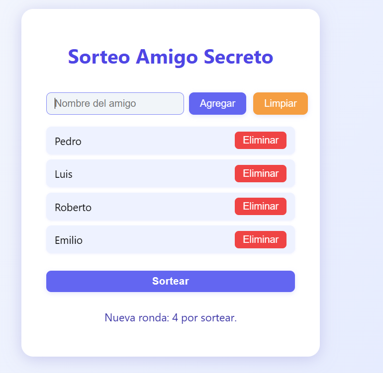
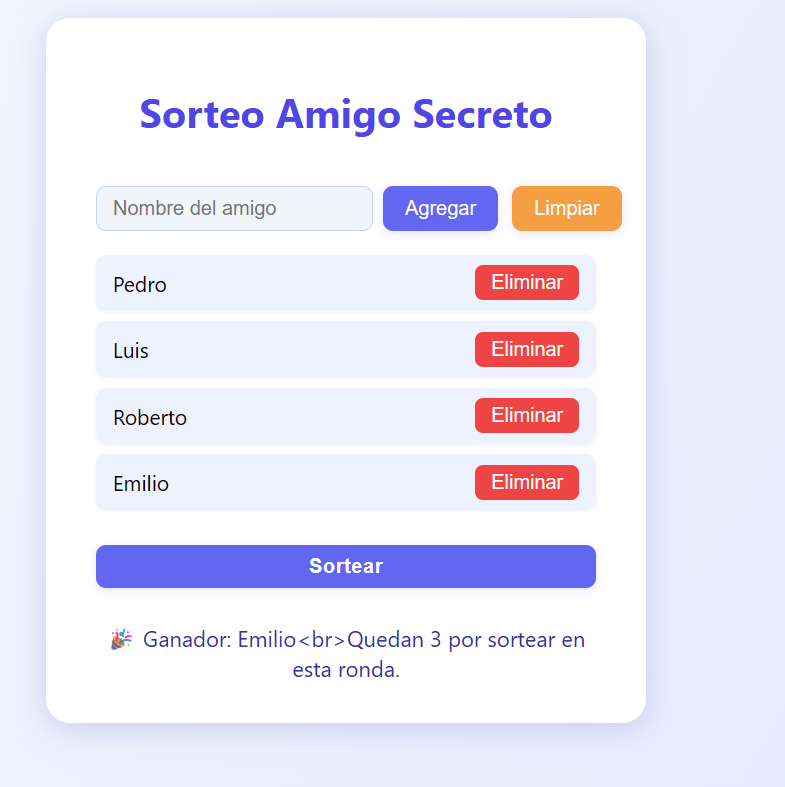

<<<<<<< HEAD
# AmigoSecreto
Primer proyecto Alura Oracle

=======
>>>>>>> 2255601 (Agrega enlace al video demostrativo)
# 🎁 Sorteo Amigo Secreto

[Repositorio en GitHub](https://github.com/fespinozar86/AmigoSecreto)

¡Bienvenido al proyecto de Sorteo Amigo Secreto!  
Esta aplicación web te permite organizar sorteos de “amigo secreto” de manera fácil, rápida y sin repeticiones, con una interfaz moderna y amigable.

---

## 🚀 Funcionalidades

- Agrega nombres de participantes de forma sencilla.
- Visualiza y elimina participantes de la lista.
- Realiza el sorteo de manera aleatoria y sin repeticiones en cada ronda.
- Interfaz gráfica atractiva y responsiva.
- Mensajes claros sobre el estado del sorteo.

---

## 🖥️ Capturas de pantalla

<<<<<<< HEAD
> 1. **Pantalla principal:**  
>    
>
> 2. **Lista de amigos agregados:**  
>    
>
> 3. **Resultado del sorteo:**  
>    
=======
1. **Pantalla principal:**  
   

2. **Lista de amigos agregados:**  
   

3. **Resultado del sorteo:**  
   
>>>>>>> 2255601 (Agrega enlace al video demostrativo)

---

## 📦 Instalación y ejecución

1. Clona o descarga este repositorio.
2. Abre la carpeta en VS Code.
3. Instala la extensión [Live Server](https://marketplace.visualstudio.com/items?itemName=ritwickdey.LiveServer) para facilitar la visualización.
4. Haz clic derecho sobre `index.html` y selecciona “Open with Live Server”.
5. ¡Listo! Usa la interfaz para agregar nombres y realizar el sorteo.

---

## ⚙️ Dependencias

- Solo necesitas un navegador web moderno (Chrome, Firefox, Edge, etc.).
- No requiere instalación de Node.js ni dependencias externas.

---

## 📝 Uso

1. Escribe el nombre de cada participante y haz clic en “Agregar”.
2. Puedes eliminar participantes antes del sorteo.
3. Haz clic en “Sortear” para elegir un ganador aleatorio.
4. El sistema evita repeticiones hasta que todos hayan salido en la ronda.
5. Usa “Limpiar” para reiniciar la lista.

---

## ❓ Problemas comunes

- Si no ves la interfaz, asegúrate de abrir `index.html` con Live Server o directamente en tu navegador.
- Si el sorteo no funciona, revisa que el archivo `sorteo.js` esté en la misma carpeta que `index.html`.

---

## 📹 Video demostrativo

<<<<<<< HEAD
> [Ver video demostrativo](enlace-a-tu-video)
=======
> [Ver video demostrativo]https://drive.google.com/drive/folders/1qzyIlJYvV6zqg0Mw3TCUml6gzdiNEN0E?usp=sharing
>>>>>>> 2255601 (Agrega enlace al video demostrativo)

---

## 👨‍💻 Autor

- Desarrollado por Francisco Espinoza

---

¡Gracias por usar y compartir este proyecto!  
<<<<<<< HEAD
¿Tienes sugerencias o mejoras? ¡No dudes en contribuir!
=======
¿Tienes sugerencias o mejoras? ¡No dudes en contribuir!
>>>>>>> 2255601 (Agrega enlace al video demostrativo)
